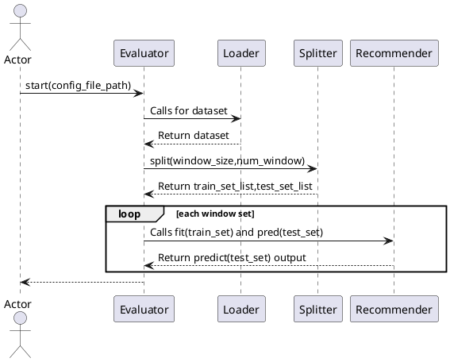
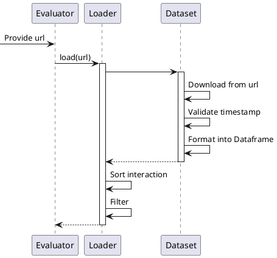
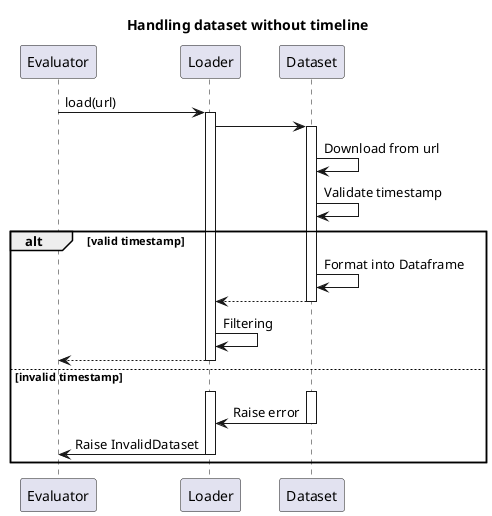
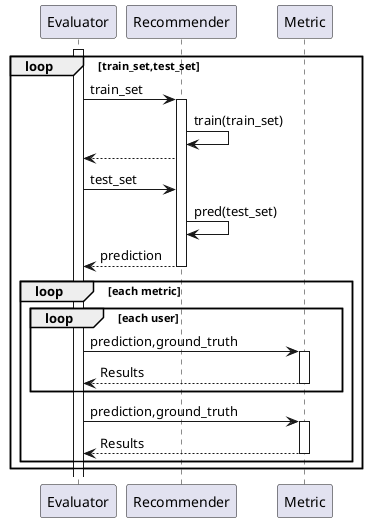
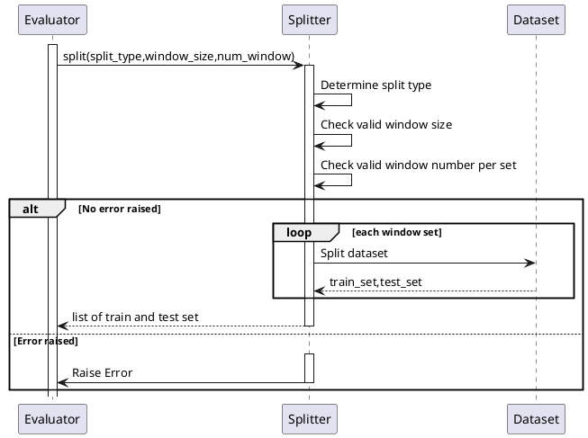
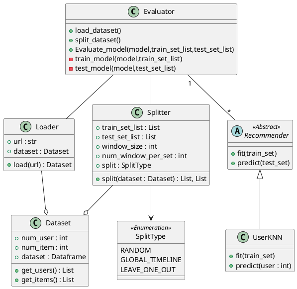

# FYP Draft 1

- [FYP Draft 1](#fyp-draft-1)
- [Architecture](#architecture)
- [Assumptions](#assumptions)
- [Procedures](#procedures)
  - [Handling of unknown user](#handling-of-unknown-user)
- [Evaluation flow](#evaluation-flow)
- [Loading dataset](#loading-dataset)
  - [Loading without error](#loading-without-error)
  - [Handling of dataset without timeline](#handling-of-dataset-without-timeline)
- [Evaluation mechanism](#evaluation-mechanism)
- [Splitting Dataset](#splitting-dataset)
  - [Class diagram](#class-diagram)

# Architecture

Proposed name: StreamSight

# Assumptions

- Dataset input must come with timestamp for partitioning
- Models used must support provided API by SteamSight

# Procedures

## Handling of unknown user

Definition of Unknown: User appears in the test set but is not seen before in the train set.

Since these unknown users cannot be evaluated, they can first be

1. Ignored
2. Be always assigned a default value such as the most popular item

# Evaluation flow

The configuration file should be stored as a yaml file and should contain the following details

- recommender_type: [KNN]
- split_type: [global_timeline|single_timeline|leave_one_out|random]
- train_data_sampled: bool
- test_data_sampled: bool
- dataset_url: str
- window_size: int
- num_window_per_set: int

---

# Loading dataset

## Loading without error

## Handling of dataset without timeline

---

# Evaluation mechanism

Following from the paper. If the evaluation metric can happen at each window and an aggregated level,
then for 
1. User level
    - Each window, and each user, we evaluate the result
2. Aggregated level
    - Each window for all users aggregated

---

# Splitting Dataset

---

## Class diagram

