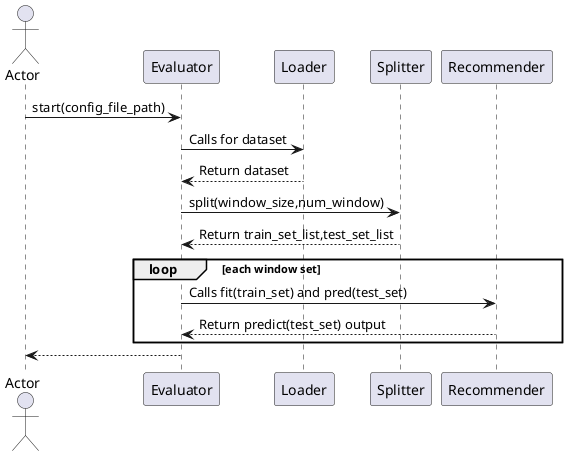
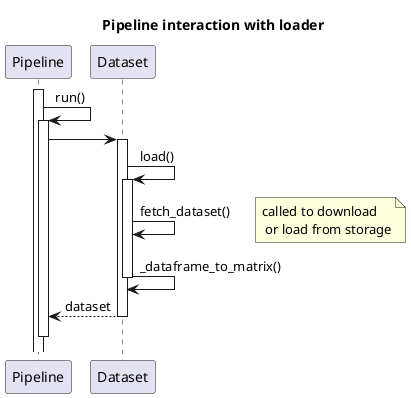
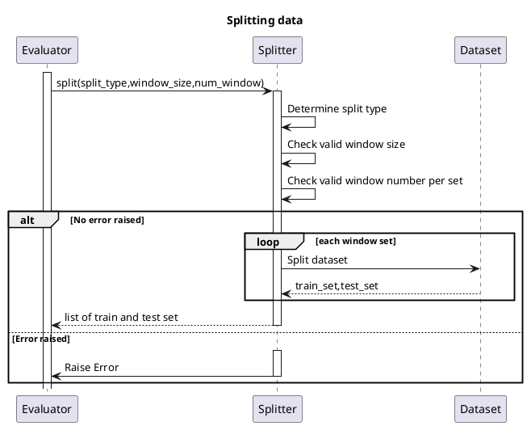
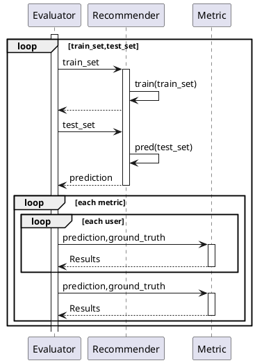
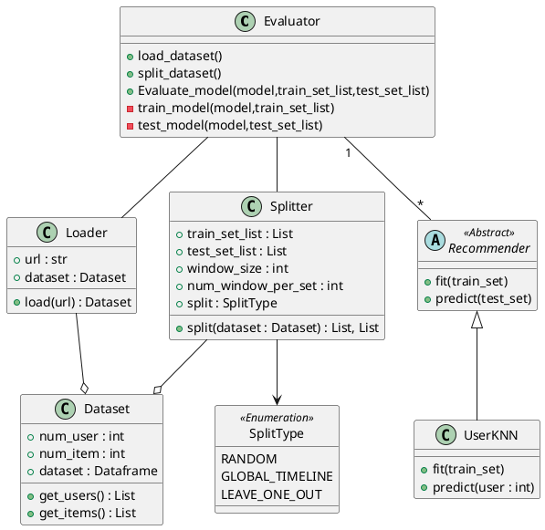

# FYP Draft 1

- [FYP Draft 1](#fyp-draft-1)
- [Architecture](#architecture)
- [Assumptions](#assumptions)
- [Questions/ Trailing solutions](#questions-trailing-solutions)
- [Documentation](#documentation)
- [Procedures](#procedures)
- [Evaluation flow](#evaluation-flow)
- [Loading dataset](#loading-dataset)
  - [Pipeline overview of loading dataset](#pipeline-overview-of-loading-dataset)
- [Splitting Dataset](#splitting-dataset)
- [Evaluation mechanism](#evaluation-mechanism)
  - [Class diagram](#class-diagram)

# Architecture

Proposed name: StreamSight

# Assumptions

- Dataset input must come with timestamp for partitioning
- Models used must support provided API by SteamSight

# Questions/ Trailing solutions

What about unknown users that appear in the test set? Meaning they are not in
training set, but in test set
- We have 2 settings, to ignore these users during evaluation
- or to set a default value for these users such as having the most popular item

# Documentation

The docstring used in the code base follows reST formatting. This is because
it is compatible with Sphinx for documentation for easy documentation generation
along the way.

# Procedures

# Evaluation flow

The flow of the 

---

# Loading dataset

## Pipeline overview of loading dataset

Pipeline builder provides the API to add the dataset of interest to the pipeline this. By calling `pipeline_builder.set_dataset(dataset)` we allow the user to specify the dataset to load. The dataset specified can be the class or a string argument.

Once the pipeline builder has the specified arguments, calling `run()` on the pipeline will cause the dataset class to be instantiated and subsequently loaded.

---

# Splitting Dataset

We split the dataset into 2 broad category. (1) Full training dataset and (2) test data. For (1) we further split it into validation train and test data if the user specifies for validation set to be created. The validation train and test is a subset of (1) and for the final model, the full training dataset will be used.

We assume that all datasets used will contain a timestamp. Instead of sorting the entire dataset then splitting by some index, we will simply use pandas build-in tools to aid us.

We take an example of splitting based on a single global timeline. Given a timestamp `t` we will filter for all rows that have the timestamp less than `t` to be part of the in-set, or (1). And for all items greater equal to `t`, it will be contained in (2).

We provide the capability to indicate a `delta_in` and `delta_out` such that the user can indicate the extent of time range for the dataset to be used. If not specified, it will be simply as explained above.

Now we take the example of a sliding global timeline. The i

Note that we can have 2 types of spliitng for the global timeline

1. To restrict the slide the entire training set window forward such that\
    the number of windows per set is preserved
2. To provide the test set as the training set for the next iteration

---

# Evaluation mechanism

Following from the paper. If the evaluation metric can happen at each window
and an aggregated level, then for

1. User level
    - Each window, and each user, we evaluate the result
2. Aggregated level
    - Each window for all users aggregated

---

## Class diagram

