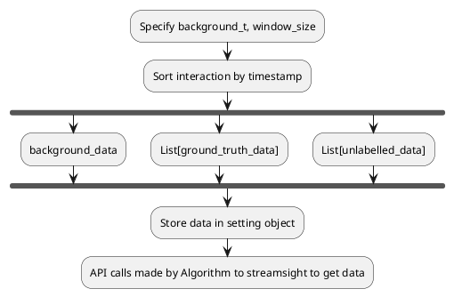
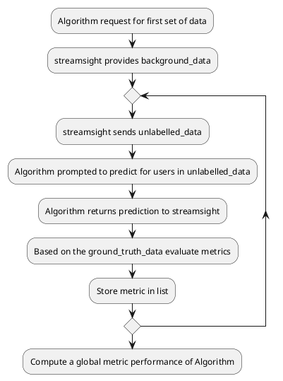
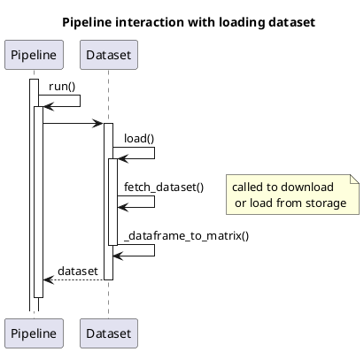
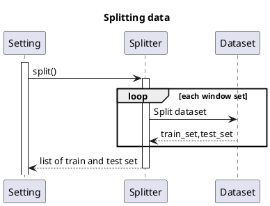
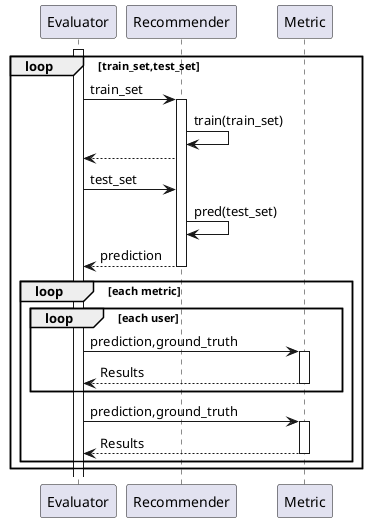

# FYP Draft 1

- [FYP Draft 1](#fyp-draft-1)
- [Architecture](#architecture)
- [Notation](#notation)
- [Error handling practices](#error-handling-practices)
- [Assumptions](#assumptions)
- [Questions/ Trailing solutions](#questions-trailing-solutions)
  - [Scenario 1](#scenario-1)
- [Documentation](#documentation)
- [Procedures](#procedures)
- [Block diagram](#block-diagram)
- [Loading dataset](#loading-dataset)
  - [Pipeline overview of loading dataset](#pipeline-overview-of-loading-dataset)
- [Splitting Dataset](#splitting-dataset)
- [Evaluation mechanism](#evaluation-mechanism)

# Architecture

Proposed name: StreamSight

# Notation

- training_set to denote the dataset that will be fed to the model for learning
- test_in is a subset of training set
- test_set to denote the dataset that will be used for evaluation of the model
- test_out is a subset of test_set
- _frame postfix denotes a list of dataset pointed to by the variable
- _series postfix denotes a single dataset pointed to by the variable

We denote the notation using in and out to make it clear that the dataset is a
in-sample or out-sample set. Out-sample also meaning held out set. This will
make the distinction of the variable naming clear during the training phase
and testing phase for clarity purposes when defining the API.

The naming _frame and _series as postfix is inspired by python pandas library
where the norm for evaluation system uses only a single train and test set. In
this implementation, there could be multiple rounds of training and this set
that contains multiple training set will be termed as frame. Similar to how
pandas uses frame to denote a multi-dimension series.

# Error handling practices

The package will log information in the API calls. We will handle errors in the
following manner

- Exceptions will be used when there is an error that occurs which violates an
  assumption or assertion in the code. In these events, the code is unable to
  continue to run.
- A warning issued in the logging is to denote that an error has occurred and
  nothing can be done about the issue. This could arise from ignoring earlier
  warnings that were highlighted or an edge case encountered in the code
- warning.warn() raised are warnings that can be avoided where the user can
  modify the parameters highlighted

# Assumptions

- Dataset input must come with timestamp for partitioning
- Models used must support provided API by SteamSight
- Unknown user handling as stated in trailing solution

# Questions/ Trailing solutions

## Scenario 1

Assuming that we have split the data and now there exist a user `u` in the test_in
set but not in the test_out set. Then, when the model guesses for user `u` there
will no be a solution for evaluation of the prediction.

Take another scenario where `u` is in test_out but not in test_in, then the model
has not seen `u` before and could either (1) throw an error or make a random guess.

For the purposes of this set up, we will make it such that only users who exist
in test_in and test_out will form the final test_in and test_out set that will
be used for evaluation purposes.

!TODO Explore the feasibility of allowing for a choice to allow unknown users
to exist in test_out


# Documentation

The docstring used in the code base follows reST formatting. This is because
it is compatible with Sphinx for documentation for easy documentation generation
along the way.

# Procedures

# Block diagram



We can use an example to explain the model above. Let us specify a time t=May as
the month to splice the dataset. Then the months from Jan-Apr will be used for
background data for the model. Let us also specify the window size as window_size=30days.
Then every subsequent set used to evaluate the model will be the following month,
and the next ground truth value released to the model will be done after the
evaluation. For example, we will ask the model to predict the data points for
May and subsequently we will release the ground truth to the model.



We can take the table below as an example of how the metric will be displayed
in the system.

![[metric_table.svg]]

# Loading dataset

## Pipeline overview of loading dataset

Pipeline builder provides the API to add the dataset of interest to the pipeline this. By calling `pipeline_builder.set_dataset(dataset)` we allow the user to specify the dataset to load. The dataset specified can be the class or a string argument.

Once the pipeline builder has the specified arguments, calling `run()` on the pipeline will cause the dataset class to be instantiated and subsequently loaded.



Alternatively, the dataset can also be loaded by manually creating the class object
of choice. In the example below, the concrete class implementation is selected and
the `load()` API is called. This will load the dataset into a `InteractionMatrix`
class.

```python
from streamsightv2.datasets import AmazonMusicDataset

dataset = AmazonMusicDataset()
data = dataset.load()
```

---

# Splitting Dataset

We split the dataset into 2 broad category. (1) Full training dataset and (2) test data. For (1) we further split it into validation train and test data if the user specifies for validation set to be created. The validation train and test is a subset of (1) and for the final model, the full training dataset will be used.

We assume that all datasets used will contain a timestamp. Instead of sorting the entire dataset then splitting by some index, we will simply use pandas build-in tools to aid us.

We take an example of splitting based on a single global timeline. Given a timestamp `t` we will filter for all rows that have the timestamp less than `t` to be part of the in-set, or (1). And for all items greater equal to `t`, it will be contained in (2).

We provide the capability to indicate a `delta_in` and `delta_out` such that the user can indicate the extent of time range for the dataset to be used. If not specified, it will be simply as explained above.

The example below shows how the single global timeline can be used to split the
dataset. `t` will be used to split the set into the train and test set.

```python
setting = SingleTimePointSetting(
    t=150,
    delta_out=50,
    delta_in=50
)
setting.split(data)
```

Now we take the example of a sliding global timeline. Depending on the value of
`delta_in`, `delta_out` and the `window_size` parameter defined, the number of split datasets
that will be created from the original dataset will vary. The window_size specified
indicates the duration that the window will slide forward by for each loop.

We can create 2 interesting scenarios by tweaking `delta_in`. (1) if `delta_in==window_size`
then the test set of the previous iteration will become the train set of the
next iteration. (2) if `delta_in==max_int` then the training set will keep
growing, as if new data is being appended to the training set.




---

# Evaluation mechanism

Following from the paper. If the evaluation metric can happen at each window
and an aggregated level, then for

1. User level
    - Each window, and each user, we evaluate the result
2. Aggregated level
    - Each window for all users aggregated



---
